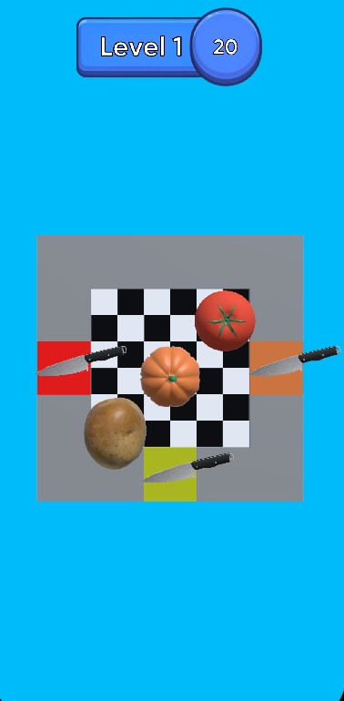
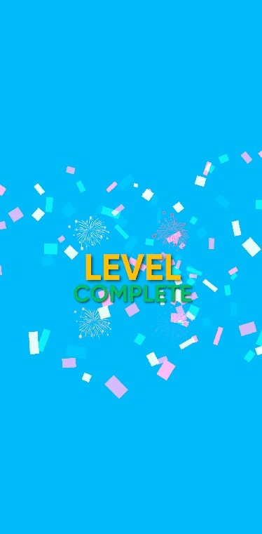
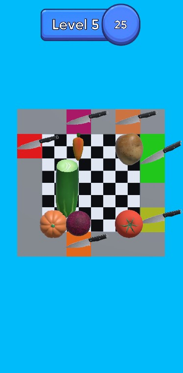
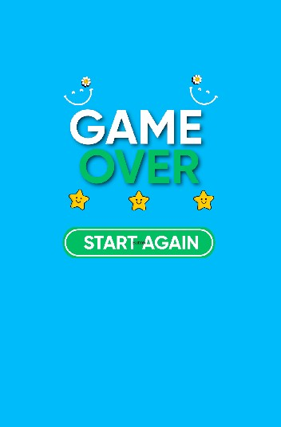

# 🥕 Cut The Vegetables  

**Cut The Vegetables** is a kitchen-themed, fun, and fast-paced puzzle game. The goal is to rescue vegetables trapped in a grid and guide them to their matching chopping boards. Once a vegetable reaches the correct board, it gets sliced with a satisfying animation, providing players with an enjoyable visual experience.  

The game mechanics are inspired by **Color Block Jam**, developed by the innovative mobile game studio **Gybe Games** and published by **Rollic**. We sincerely thank Gybe Games and Rollic for their creativity and inspiration. 🙌  

🎮 **Try it quickly here:**  
👉 [Unity Play Link]([https://play.unity.com/en/games/379b35bc-1a0e-4150-8f6c-53e19ee6579a/cut-the-vegetables](https://play.unity.com/en/games/379b35bc-1a0e-4150-8f6c-53e19ee6579a/cut-the-vegetables))  

---

## 🎮 Gameplay  

- 🥗 **Objective:** Rescue vegetables (tomato, carrot, potato, pumpkin, red cabbage, cucumber, etc.) from tight spots and guide them to the chopping board that matches their color.  
- ⏱️ **Time Limit:** Guide all vegetables to their correct boards within **30 seconds** per level.  
- 🔪 **Animation:** Vegetables that reach the correct board are sliced with a kitchen knife animation, offering visual satisfaction.  
- 📦 **Current Levels:** The game currently features **5 levels**, providing a short but engaging experience to familiarize yourself with the core mechanics. 🚀  

---

## 📸 Screenshots  

  
  
  
  
  

  

---

## 🛠️ Technical Info  

- Developed using **Unity 6**.  
- Although the project uses **3D models**, the camera perspective and lighting setup make the game appear **2D**, ensuring both visual clarity and performance.  
- The game scene is built on a **grid-based system**. The grid manages each vegetable's position and possible movements, preventing overlaps and making it easy to guide vegetables to the correct boards.  
- **GPU Instancing** is implemented, allowing many objects using the same material to be processed in a single draw call, reducing batches by up to 25% and improving performance.  

---

## ❤️ Credits  

- **Game Idea & Development:** Turgay Çelik  
- **Inspired by:** *Color Block Jam* (Gybe Games / Rollic)  
