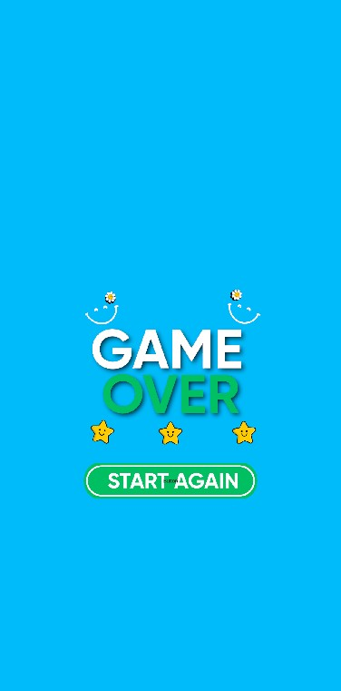

# 🥕 Cut The Vegetables  

**Cut The Vegetables**, mutfak temalı, eğlenceli ve hızlı tempolu bir puzzle oyunudur. Amaç, sebzeleri sıkışmış oldukları grid alanından kurtarıp kendi renklerine uygun doğrama tahtalarına yönlendirmektir. Doğru doğrama tahtasına ulaşan sebze, hoş bir animasyonla doğranır ve oyuncuya keyifli bir görsel deneyim sunar.  

Oyun mekanikleri, mobil oyun dünyasının en başarılı ve yenilikçi stüdyolarından biri olan **Gybe Games** tarafından geliştirilen ve **Rollic** yayıncılığını üstlendiği **Color Block Jam** oyunundan ilham alınarak tasarlanmıştır. Oyun sektörüne kattıkları yaratıcılıktan ötürü Gybe Games ve Rollic’e teşekkürlerimizi sunarız. 🙌  

🎮 **Hızlıca denemek için:**  
👉 [Unity Play Link](https://play.unity.com/en/games/379b35bc-1a0e-4150-8f6c-53e19ee6579a/cut-the-vegetables)  

---

## 🎮 Gameplay  

- 🥗 Amacınız: Sebzeleri (domates, havuç, patates, balkabağı, kırmızı lahana, salatalık vb.) sıkışıklıklardan kurtararak aynı renkteki doğrama tahtasına ulaştırmak.  
- ⏱️ Süre: Her levelde **30 saniye** içerisinde tüm sebzeleri doğru tahtalara yönlendirin.  
- 🔪 Animasyon: Doğru tahtaya ulaşan sebzeler, mutfak bıçağı animasyonu ile doğranarak görsel bir tatmin sağlar.  

---

## 📸 Screenshots  

  
  
  
  
  

  

---

## 🛠️ Tech Info  

- Unity 6 ile geliştirilmiştir.  
- Projede **3D modeller** kullanılmış ancak kamera perspektifi ve ışık ayarları sayesinde oyun **2D görünüme** sahiptir. Böylece hem görsel sadelik hem de performans korunmuştur.  
- Oyun sahnesi **grid tabanlı bir sistem** üzerine kurulmuştur. Grid, her sebzenin pozisyonunu ve olası hareketlerini yönetir. Böylece çakışmalar engellenir ve doğru tahtaya yönlendirme kolayca kontrol edilir.  
- **GPU Instancing** tekniği kullanılmıştır. Bu sayede aynı materyali kullanan çok sayıda obje tek draw call altında işlenir ve %25’e kadar daha az batch ile daha yüksek performans sağlanmıştır.  

---

## ❤️ Credits  

- **Game Idea & Development:** Turgay Çelik  
- **Inspired by:** *Color Block Jam* (Gybe Games / Rollic)  
